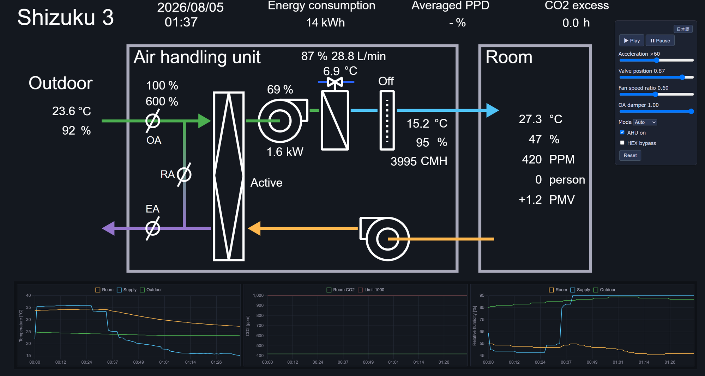

# Shizuku3

A BACnet-accessible building emulator for learning HVAC control — from manual operation
and PID to reinforcement learning.



Shizuku3 provides a physical model of a thermal zone and an air handling unit (AHU)
**without any built-in controller**. Students control the plant from outside via BACnet —
first by hand, then with PID controllers they write themselves, and finally with
reinforcement learning agents — all against the same interface.

## Features

- **Plant model** (C# / [Popolo](https://www.nuget.org/packages/Popolo.Core)):
  a south-perimeter office zone (176.5 m²) served by a single-duct AHU
  (cooling/heating coil, supply & return fans, rotary energy recovery wheel,
  evaporative humidifier, outdoor air damper). No VAV — the students' manipulated
  variables are the water valve, fan speed and OA damper.
- **Stochastic disturbances** with independent random seeds:
  weather (VAR-model generator), occupant presence (Markov behavior model),
  and chilled/hot water supply temperature (AR(1) process) — the "difficulty knobs".
- **CO2 balance** and demand-controlled-ventilation exercises via the OA damper.
- **KPIs**: energy (coil load / system COP + fan power), occupied-hours PPD integral
  (optionally occupant-weighted), CO2-excess hours.
- **Time control**: acceleration rate (0 = pause) and pause-at-time via BACnet,
  enabling deterministic step execution (the basis for a Gymnasium-style wrapper).
- **BACnet/IP interface** (BACnet 4.0.0): ~40 points — 9 writable controls,
  measurements, KPIs and simulation management. Works with Yabe and bacpypes3.
- **Web GUI** (Python / FastAPI + WebSocket): a dark-themed BEMS-style system
  diagram (SVG) with live values, trend charts (temperature / CO2 / humidity)
  and an operation panel (English/Japanese).

## Repository layout

```
emulator/    C# emulator (plant model + BACnet server)
client/      Python client library (pip-installable; a Gymnasium wrapper will live here)
gui/         BEMS-style web GUI (FastAPI + WebSocket)
examples/    Sample and diagnostic scripts (PID / RL exercises will live here)
docs/        Specifications (Japanese)
```

## Getting started

Prerequisite: Python 3.10+, installed with "Add python.exe to PATH" checked.
The [release zip](https://github.com/et0614/shizuku3/releases) contains a
self-contained `Shizuku3.exe`, so no .NET installation is needed; building the
emulator from source additionally requires the
[.NET SDK 10](https://dotnet.microsoft.com/).

### Quick start (Windows)

1. Download the latest [release](https://github.com/et0614/shizuku3/releases)
   and unzip it anywhere.
2. Double-click **`Shizuku3.exe`** — the BACnet server starts paused
   (acceleration 0). Simulation settings (start date, time step, seeds,
   COPs, ...) are in `setting.ini`.
3. Double-click **`setup.bat`** — one time only. It creates a virtual
   environment (`.venv`) and installs the Python packages
   (downloads PyTorch; takes a while).
4. Double-click **`start_gui.bat`** — a browser opens at
   `http://127.0.0.1:8000`. Press **Play** to start the clock.
5. To run the course examples, double-click **`console.bat`** and type e.g.
   `python examples\01_onoff_control.py`.

### What the helpers do (manual equivalent)

The bat files only automate ordinary commands. On Linux/macOS — or if you
prefer to see each step — run them yourself from the repository root:

```
python -m venv .venv             # setup.bat: create a virtual environment...
.venv\Scripts\activate           #   (Linux/macOS: source .venv/bin/activate)
pip install -e "client[all]"     #   ...and install the client + extras
python gui/server.py             # start_gui.bat: start the web GUI
```

The virtual environment is recommended because the `[rl]`/`[all]` extras pull
in PyTorch via Stable-Baselines3 — isolation keeps your global site-packages
clean. Lighter installs: `client` (BACnet client only), `client[gui]` (web
GUI), `client[rl]` (Gymnasium + Stable-Baselines3 for the RL examples).

To run the emulator from source instead of the released exe:

```
cd emulator
dotnet run --project Shizuku3
```

### Or use any BACnet client

The device (ID 3000) answers on the standard broadcast port 47808 and unicasts
from the exclusive port 47809 (`127.0.0.1:47809` by default; see `setting.ini`).
Writing to `AnalogValue 301 (AccelerationRate)` starts the simulation.

### Or script it in Python

In the venv (`console.bat` opens one ready to use):

```python
from shizuku3client import Shizuku3Client

emu = Shizuku3Client()
emu.write("WaterValvePosition", 0.6)
emu.step(minutes=5)                    # advance 5 min and pause (Gym-style)
print(emu.read("RoomTemperature"))
```

## Documentation

Detailed specifications (physical model, `setting.ini`, BACnet point list) are in
[`docs/`](docs/) (Japanese).

## Background

Shizuku3 is an offshoot of the
[World Championship in Cybernetic Building Optimization (WCCBO)](https://www.wccbo.org),
a competition that quantitatively scores building-operation optimization skills
on realistic building emulators. The emulators developed for the championships —
Shizuku (1st WCCBO) and [Shizuku2](https://github.com/et0614/shizuku2)
(2nd WCCBO) — are the direct ancestors of this project. Shizuku3 brings the same
emulator concept to classroom control education: a single AHU system and one
thermal zone, deliberately stripped of controllers, with the building physics
computed by the [Popolo](https://www.nuget.org/packages/Popolo.Core) library by
the same author.

## Acknowledgements

The BACnet communication layer is built on the
[BACnet](https://www.nuget.org/packages/BACnet) library.

## License

[GPL-3.0](LICENSE)
